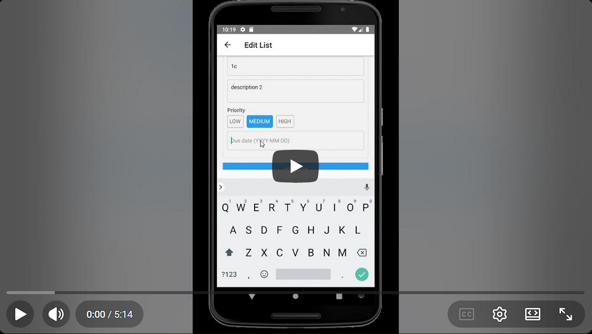
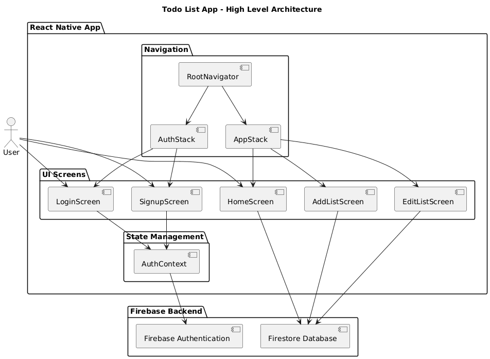

# Todo Lists App

A modern Android todo list application built with React Native and Firebase.
Features include authentication, list management, task tracking, deadlines, and a polished mobile UI.

## App Demo

A short demo video showcasing how the application works:

## Features

### Authentication

- User signup and login using Firebase Authentication
- Persistent login state
- Secure logout

### List Management

- Create, edit, and delete todo lists
- Expandable list view
- Selection mode for bulk list deletion

### Task Management

- Add tasks with:
  - Title
  - Description
  - Due date
  - Priority
- Mark tasks as completed
- View task progress per list

### Deadlines & Status

- Visual indicators for:
  - Overdue tasks
  - Due today
  - Due tomorrow
  - Upcoming deadlines

### UI & UX

- Modern card-based UI
- Floating Action Button (FAB) for adding lists
- Bottom action sheet for list actions
- Responsive layout with keyboard handling

## Tech Stack

- **React Native** (TypeScript)
- **Firebase Authentication**
- **Firebase Firestore**
- **React Navigation**
- **Android (primary target)**

## Architecture Overview

- `screens/` – App screens (Login, Signup, Home, Add/Edit List)
- `components/` – Reusable UI components (ListItem, ActionSheet)
- `navigation/` – Stack and root navigators
- `context/` – Authentication context (AuthContext)
- Firestore used as the single source of truth for lists and tasks

## Design Diagram

## Design Decisions

- Used expandable list cards to allow users to quickly scan progress or dive into details
- Floating Action Button chosen for primary action to match Android design conventions
- Bottom action sheet used instead of alerts for a modern, non-blocking UX
- Visual deadline indicators added to improve task prioritization

## Future Improvements

- Push notifications for upcoming deadlines
- Task reordering via drag and drop
- Dark mode support
- Task tags and filtering
- Offline support with Firestore persistence
- Concurrency control and duplicate login prevention
- Editable profiles
